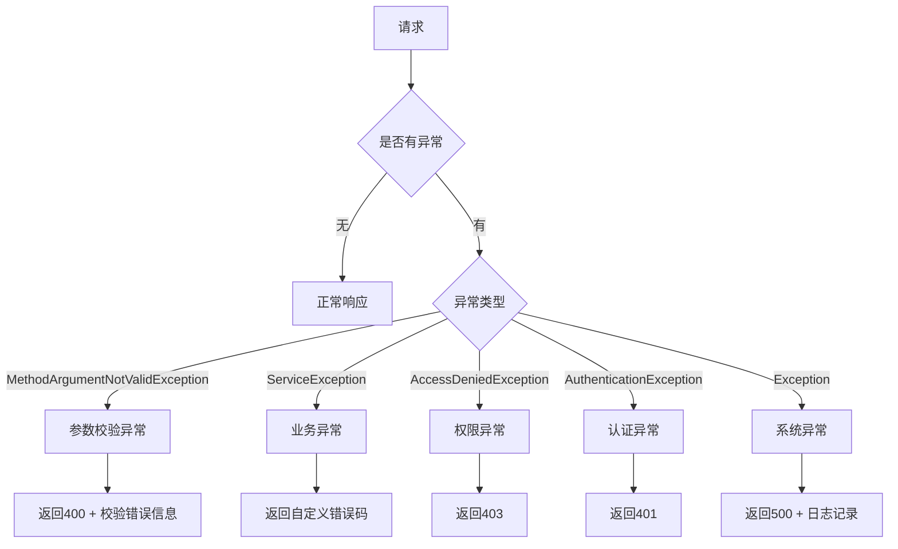
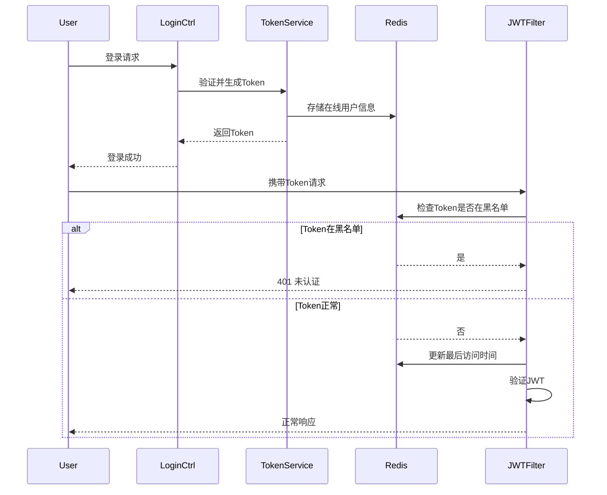
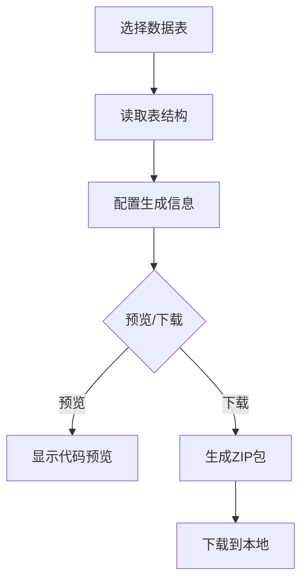
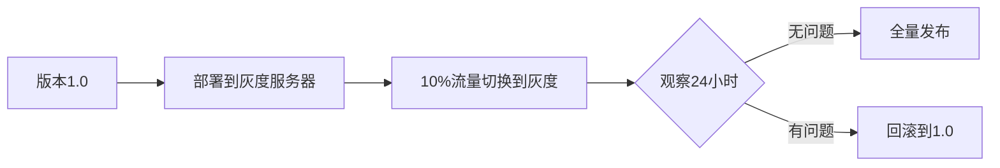

# iAdmin V2.0 版本升级 PRD

> **项目名称**: iAdmin 后台管理系统 V3.0 升级
>
> **文档版本**: 2.0
>
> **创建日期**: 2025-02-05
>
> **技术栈**: Spring Boot 3.2 + Java 21

---

# 目录

- [第一部分：需求文档](#第一部分需求文档)
  - [1. 项目背景](#1-项目背景)
  - [2. 升级目标](#2-升级目标)
  - [3. 详细需求](#3-详细需求)
  - [4. 优先级划分](#4-优先级划分)
  - [5. 里程碑规划](#5-里程碑规划)
  - [6. 附录](#6-附录)
- [第二部分：技术方案设计](#第二部分技术方案设计)
  - [1. 架构设计](#1-架构设计)
  - [2. 技术栈升级方案](#2-技术栈升级方案)
  - [3. 核心功能设计](#3-核心功能设计)
  - [4. 数据库设计](#4-数据库设计)
  - [5. 安全设计](#5-安全设计)
  - [6. 测试策略](#6-测试策略)
  - [7. 部署方案](#7-部署方案)
  - [8. 风险评估](#8-风险评估)
  - [9. 后续优化方向](#9-后续优化方向)
- [第三部分：任务分解](#第三部分任务分解)
  - [Sprint 1: 安全漏洞修复 + 基础架构优化](#sprint-1-安全漏洞修复--基础架构优化)
  - [Sprint 2: 数据权限功能](#sprint-2-数据权限功能)
  - [Sprint 3: 用户管理与审计功能](#sprint-3-用户管理与审计功能)
  - [Sprint 4: 监控与开发工具](#sprint-4-监控与开发工具)
  - [验收与发布](#验收与发布)

---

# 第一部分：需求文档

## 1. 项目背景

iAdmin 是一个基于 Spring Boot 的后台管理系统，当前版本（0.0.1-SNAPSHOT）使用的技术栈较为陈旧，存在以下问题：

- **安全风险**：Fastjson 1.2.54 存在严重安全漏洞（CVE-2019-14869等）
- **版本过旧**：Spring Boot 2.2.2.RELEASE 发布于2019年，已停止维护
- **Java版本过期**：Java 8 已于2025年停止付费支持，无法使用新特性
- **技术栈债务**：使用 `javax.*` 包名，而非 Jakarta EE 标准
- **JWT库过期**：jjwt 0.9.1 已被新版本替代
- **功能缺失**：缺少企业级常用功能（如数据权限、消息通知、在线用户管理等）
- **代码规范**：缺少统一异常处理、参数校验等规范

## 2. 升级目标

### 2.1 核心目标
1. 消除已知安全漏洞，确保系统安全
2. 升级到 **Spring Boot 3.2 + Java 21** 前沿技术栈
3. 完成 `javax.*` 到 `jakarta.*` 的包名迁移
4. 增加企业级必备功能
5. 提升代码质量和可维护性

### 2.2 非功能性目标
- 采用2025年主流技术栈，延长系统生命周期
- 利用 Java 21 新特性（虚拟线程、记录模式、模式匹配等）
- 确保升级过程平滑，支持灰度发布
- 完善测试覆盖率

## 3. 详细需求

### 需求1 - 安全漏洞修复与依赖升级

**用户故事:** 作为系统管理员，我需要系统使用无安全漏洞的依赖版本，以确保生产环境安全。

#### 验收标准

| AC编号 | 描述 (EARS语法) |
|--------|-----------------|
| AC-1.1 | 当系统启动时，iAdmin 应当使用无已知高危漏洞的依赖版本 |
| AC-1.2 | 当处理JSON数据时，系统 应当使用 Jackson 替代 Fastjson |
| AC-1.3 | 当生成JWT令牌时，系统 应当使用 jwt-api 0.11.x+ 版本 |
| AC-1.4 | 当系统运行时，所有依赖 应当通过 Maven Enforcer 插件进行版本检查 |

#### 依赖版本对照表

| 依赖 | 当前版本 | 目标版本 | 升级原因 |
|------|----------|----------|----------|
| **Java** | 8 | **21** | 2025年最新LTS，支持虚拟线程、记录模式等新特性 |
| **Spring Boot** | 2.2.2.RELEASE | **3.2.x** | 2025年主流版本，基于 Jakarta EE |
| **Spring Security** | 5.2.1.RELEASE | **6.2.x** | 与 Boot 3 配套 |
| **包命名** | javax.* | **jakarta.*** | Jakarta EE 9+ 标准 |
| Fastjson | 1.2.54 | **移除** | 存在严重漏洞，使用Jackson替代 |
| jjwt | 0.9.1 | **jwt-api 0.12.x** | 原版本已废弃 |
| MyBatis-Plus | 3.3.0 | **3.5.6+** | 支持 Boot 3 的版本 |
| Druid | 1.1.14 | **1.2.23** | 安全修复 |
| Hutool | 5.0.6 | **5.8.28** | 功能增强 |
| POI | 3.17 | **5.3.0** | 安全修复 |
| Swagger | 2.9.2 | **SpringDoc 2.3+** | Swagger 2 不兼容 Boot 3 |

---

### 需求2 - 统一异常处理与响应封装

**用户故事:** 作为前端开发人员，我需要后端返回统一的响应格式，以便统一处理错误和成功状态。

#### 验收标准

| AC编号 | 描述 (EARS语法) |
|--------|-----------------|
| AC-2.1 | 当发生任何异常时，系统 应当返回统一格式的JSON响应 |
| AC-2.2 | 当业务异常发生时，系统 应当返回包含错误码和错误信息的响应 |
| AC-2.3 | 当参数校验失败时，系统 应当返回包含具体字段错误信息的响应 |
| AC-2.4 | 当系统异常被捕获时，系统 应当记录完整的异常堆栈日志 |

#### 响应格式定义

```json
// 成功响应
{
  "code": 200,
  "message": "操作成功",
  "data": {}
}

// 失败响应
{
  "code": 400,
  "message": "参数校验失败",
  "data": null,
  "errors": ["用户名不能为空"]
}
```

---

### 需求3 - 数据权限功能

**用户故事:** 作为企业管理员，我需要配置数据权限规则，使得不同角色只能查看权限范围内的数据。

#### 验收标准

| AC编号 | 描述 (EARS语法) |
|--------|-----------------|
| AC-3.1 | 当查询用户列表时，系统 应当根据当前用户的数据权限过滤结果 |
| AC-3.2 | 当管理员配置数据权限时，系统 应当支持以下权限类型：全部数据、本部门数据、本部门及以下数据、仅本人数据、自定义数据 |
| AC-3.3 | 当用户拥有多个角色时，系统 应当取各角色数据权限的并集 |
| AC-3.4 | 当执行数据权限查询时，系统 应当通过注解方式自动应用权限过滤 |

#### 数据权限类型

| 权限类型 | 说明 | 实现方式 |
|----------|------|----------|
| 全部数据权限 | 查看所有数据 | 无过滤条件 |
| 自定义数据权限 | 查看指定部门数据 | IN (dept_id) |
| 本部门数据权限 | 只查看本部门数据 | = dept_id |
| 本部门及以下数据权限 | 查看本部门及子部门数据 | IN (子部门查询) |
| 仅本人数据权限 | 只查看本人数据 | = user_id |

---

### 需求4 - 在线用户管理

**用户故事:** 作为系统管理员，我需要查看当前在线用户并能够强制下线指定用户，以管理并发登录和安全问题。

#### 验收标准

| AC编号 | 描述 (EARS语法) |
|--------|-----------------|
| AC-4.1 | 当管理员访问在线用户页面时，系统 应当显示所有当前在线用户列表 |
| AC-4.2 | 当管理员点击强制下线时，系统 应当使指定用户的token失效 |
| AC-4.3 | 当用户被强制下线后，系统 应当在该用户下次请求时返回401状态码 |
| AC-4.4 | 当在线用户列表展示时，系统 应当显示用户名、登录IP、登录时间、最后访问时间等信息 |

---

### 需求5 - 操作日志增强

**用户故事:** 作为安全审计人员，我需要查看完整的用户操作记录，包括请求参数和响应结果，以便进行安全审计。

#### 验收标准

| AC编号 | 描述 (EARS语法) |
|--------|-----------------|
| AC-5.1 | 当用户执行增删改操作时，系统 应当自动记录操作日志 |
| AC-5.2 | 当记录操作日志时，系统 应当包含：操作模块、操作类型、请求参数、响应结果、执行时长、操作状态 |
| AC-5.3 | 当请求参数超过长度限制时，系统 应当截断或敏感信息脱敏 |
| AC-5.4 | 当操作失败时，系统 应当记录异常信息 |

---

### 需求6 - 系统监控功能

**用户故事:** 作为运维人员，我需要查看系统运行状态和性能指标，以便及时发现和处理问题。

#### 验收标准

| AC编号 | 描述 (EARS语法) |
|--------|-----------------|
| AC-6.1 | 当访问系统监控页面时，系统 应当显示服务器信息（操作系统、Java版本、运行时间） |
| AC-6.2 | 当查看JVM信息时，系统 应当显示堆内存、非堆内存、线程数、GC统计 |
| AC-6.3 | 当查看磁盘信息时，系统 应当显示各分区的总容量、已用容量、使用率 |
| AC-6.4 | 当数据刷新时，系统 应当支持定时自动刷新或手动刷新 |

---

### 需求7 - 代码生成器

**用户故事:** 作为开发人员，我需要通过数据库表快速生成CRUD代码，以提高开发效率。

#### 验收标准

| AC编号 | 描述 (EARS语法) |
|--------|-----------------|
| AC-7.1 | 当选择数据库表时，系统 应当读取表结构信息（字段名、类型、注释） |
| AC-7.2 | 当配置生成信息时，系统 应当支持设置：包路径、模块名、业务名、功能名、作者 |
| AC-7.3 | 当生成代码时，系统 应当生成：Entity、Mapper、Service、Controller、前端页面 |
| AC-7.4 | 当生成代码时，系统 应当支持预览和下载ZIP包 |

---

### 需求8 - 参数校验增强

**用户故事:** 作为开发人员，我需要使用声明式参数校验，以减少重复代码并提高代码可读性。

#### 验收标准

| AC编号 | 描述 (EARS语法) |
|--------|-----------------|
| AC-8.1 | 当使用@Validated注解时，系统 应当自动校验方法参数 |
| AC-8.2 | 当校验失败时，系统 应当返回格式化的错误信息 |
| AC-8.3 | 当自定义校验规则时，系统 应当支持自定义注解实现 |
| AC-8.4 | 当分组校验时，系统 应当支持不同场景使用不同校验规则 |

---

### 需求9 - 接口文档优化

**用户故事:** 作为前端开发人员，我需要完善的接口文档以便快速理解和使用后端接口。

#### 验收标准

| AC编号 | 描述 (EARS语法) |
|--------|-----------------|
| AC-9.1 | 当访问Swagger页面时，系统 应当显示所有接口的完整文档 |
| AC-9.2 | 当查看接口文档时，系统 应当显示请求参数、响应格式、错误码说明 |
| AC-9.3 | 当接口需要认证时，系统 应当支持在Swagger中输入Authorization头 |
| AC-9.4 | 当生产环境部署时，系统 应当禁用Swagger访问 |

---

### 需求10 - 缓存管理功能

**用户故事:** 作为系统管理员，我需要查看和清理Redis缓存，以便维护系统性能和数据一致性。

#### 验收标准

| AC编号 | 描述 (EARS语法) |
|--------|-----------------|
| AC-10.1 | 当访问缓存管理页面时，系统 应当显示所有缓存键名列表 |
| AC-10.2 | 当查看缓存详情时，系统 应当显示缓存键名、缓存类型、过期时间、缓存内容 |
| AC-10.3 | 当执行清理操作时，系统 应当支持清理单个缓存或清空所有缓存 |
| AC-10.4 | 当缓存名称包含前缀时，系统 应当支持按前缀模糊搜索 |

## 4. 优先级划分

| 优先级 | 需求 | 理由 |
|--------|------|------|
| P0 (紧急) | 需求1：安全漏洞修复 | 存在严重安全漏洞，必须立即修复 |
| P0 (紧急) | 需求2：统一异常处理 | 基础架构改进，后续功能依赖 |
| P1 (高) | 需求3：数据权限 | 企业级核心功能 |
| P1 (高) | 需求8：参数校验增强 | 代码质量提升 |
| P2 (中) | 需求4：在线用户管理 | 运营功能增强 |
| P2 (中) | 需求5：操作日志增强 | 审计功能完善 |
| P2 (中) | 需求10：缓存管理 | 运维便利性 |
| P3 (低) | 需求6：系统监控 | 优化体验 |
| P3 (低) | 需求7：代码生成器 | 开发效率工具 |
| P3 (低) | 需求9：接口文档优化 | 开发体验优化 |

## 5. 里程碑规划

| 里程碑 | 目标 | 预计周期 |
|--------|------|----------|
| Milestone 1 | 安全漏洞修复 + 基础架构优化（需求1、2、8） | Sprint 1 |
| Milestone 2 | 数据权限功能（需求3） | Sprint 2 |
| Milestone 3 | 用户管理与审计功能（需求4、5、10） | Sprint 3 |
| Milestone 4 | 监控与开发工具（需求6、7、9） | Sprint 4 |

## 6. 附录

### 6.1 错误码定义

| 错误码 | 说明 |
|--------|------|
| 200 | 操作成功 |
| 400 | 参数错误 |
| 401 | 未认证 |
| 403 | 无权限 |
| 404 | 资源不存在 |
| 500 | 系统错误 |
| 1001 | 用户名或密码错误 |
| 1002 | 账号已被锁定 |
| 1003 | 验证码错误 |
| 1004 | 账号已过期 |

### 6.2 数据库变更说明

升级过程中需要新增以下表：

- `sys_role_dept` - 角色部门关联表（数据权限）

### 6.3 配置变更说明

- 新增JWT配置项
- 新增数据权限配置项
- 修改Redis配置以支持缓存管理

---

# 第二部分：技术方案设计

## 1. 架构设计

### 1.1 整体架构

```
┌─────────────────────────────────────────────────────────────────┐
│                         Frontend Layer                          │
│                    (Vue.js / Element UI)                        │
└──────────────────────────────┬──────────────────────────────────┘
                               │ HTTP/REST API
                               ▼
┌─────────────────────────────────────────────────────────────────┐
│                      Web Layer (Controller)                     │
│  ┌──────────┐ ┌──────────┐ ┌──────────┐ ┌─────────────────────┐ │
│  │ Login    │ │ SysUser  │ │ SysRole  │ │ SysMonitor         │ │
│  │          │ │          │ │          │ │                     │ │
│  └──────────┘ └──────────┘ └──────────┘ └─────────────────────┘ │
└──────────────────────────────┬──────────────────────────────────┘
                               │
                               ▼
┌─────────────────────────────────────────────────────────────────┐
│                      Service Layer                              │
│  ┌──────────┐ ┌──────────┐ ┌──────────┐ ┌─────────────────────┐ │
│  │ Auth     │ │ UserService│ RoleService│ CacheService        │ │
│  │ Service  │ │          │ │          │ │                     │ │
│  └──────────┘ └──────────┘ └──────────┘ └─────────────────────┘ │
└──────────────────────────────┬──────────────────────────────────┘
                               │
                               ▼
┌─────────────────────────────────────────────────────────────────┐
│                      Persistence Layer                          │
│  ┌──────────┐ ┌──────────┐ ┌─────────────────────────────────┐ │
│  │ Mapper   │ │ Redis    │ │ Data Scope Handler              │ │
│  │ (MyBatis)│ │          │ │                                 │ │
│  └──────────┘ └──────────┘ └─────────────────────────────────┘ │
└──────────────────────────────┬──────────────────────────────────┘
                               │
                               ▼
┌─────────────────────────────────────────────────────────────────┐
│                      Data Layer                                 │
│  ┌──────────┐ ┌──────────┐                                     │
│  │  MySQL   │ │  Redis   │                                     │
│  └──────────┘ └──────────┘                                     │
└─────────────────────────────────────────────────────────────────┘
```

### 1.2 模块依赖关系

```
┌─────────────────┐
│  iadmin-tools   │  代码生成、邮件工具等
└────────┬────────┘
         │
┌────────▼─────────────────────────────────┐
│          iadmin-common                   │  公共模块
│  ┌────────────────────────────────────┐ │
│  │ - Base Entity / VO / Query        │ │
│  │ - Utils (日期、字符串、加密等)     │ │
│  │ - Annotations (Log, DataScope等)  │ │
│  │ - Exception Handler               │ │
│  │ - Security Configuration          │ │
│  └────────────────────────────────────┘ │
└────────┬─────────────────────────────────┘
         │
    ┌────┴────┐
    │         │
┌───▼────┐  ┌▼───────────┐  ┌──────────────┐
│ system │  │  monitor   │  │    quartz    │
│        │  │            │  │              │
└────────┘  └────────────┘  └──────────────┘
```

## 2. 技术栈升级方案

### 2.1 核心依赖版本

| 依赖 | 当前版本 | 目标版本 | 升级要点 |
|------|----------|----------|----------|
| **Java** | 8 | **21** | 虚拟线程、记录模式、模式匹配、switch表达式等 |
| **Spring Boot** | 2.2.2.RELEASE | **3.2.5** | 基于Jakarta EE，包名变化 |
| **Spring Security** | 5.2.1.RELEASE | **6.2.4** | 配置类调整，SecurityFilterChain变化 |
| **javax → jakarta** | javax.* | **jakarta.*** | 全量替换import语句 |
| MyBatis-Plus | 3.3.0 | **3.5.7** | 支持 Boot 3 |
| Druid | 1.1.14 | **1.2.23** | 配置项调整 |
| JWT | jjwt 0.9.1 | **jwt-api 0.12.6** | API变化，需调整 |
| Hutool | 5.0.6 | **5.8.28** | 兼容性良好 |
| Fastjson | 1.2.54 | **移除** | 使用Jackson替代 |
| Swagger | 2.9.2 | **SpringDoc 2.5.0** | OpenAPI 3.0 |

### 2.2 Java 21 新特性应用

| 特性 | 应用场景 | 代码示例 |
|------|----------|----------|
| **虚拟线程** | 高并发接口（如在线用户查询） | `Executors.newVirtualThreadPerTaskExecutor()` |
| **记录模式** | 简化数据类（VO/Query） | `record UserVO(String name, Integer age) {}` |
| **模式匹配** | 类型判断和转换 | `if (obj instanceof String s)` |
| **switch表达式** | 枚举处理 | `switch (type) { case ALL -> ... }` |
| **文本块** | SQL/JSON字符串 | `"""SELECT * FROM user"""` |
| **record类** | 不可变数据传输对象 | `public record AjaxResult(int code, String message) {}` |

### 2.3 javax → jakarta 包名迁移

这是 Spring Boot 3 最显著的破坏性变更，需要全量替换所有 `javax.*` import。

#### 迁移清单

| 旧包名 | 新包名 | 影响范围 |
|--------|--------|----------|
| javax.servlet.* | jakarta.servlet.* | Filter、Servlet API |
| javax.persistence.* | jakarta.persistence.* | JPA 注解（如果使用） |
| javax.validation.* | jakarta.validation.* | 参数校验注解 |
| javax.annotation.* | jakarta.annotation.* | @PostConstruct、@Resource 等 |
| javax.security.* | jakarta.security.* | 安全相关 |
| javax.xml.bind.* | jakarta.xml.bind.* | XML 绑定（如果使用） |

#### 迁移工具

```bash
# 1. 使用 IDE 自动替换（推荐）
# IDE → Edit → Find → Replace in Path

# 2. 使用 OpenRewrite（批量迁移）
mvn org.openrewrite.maven:rewrite-maven-plugin:run \
  -Drewrite.activeRecipes=io.github.qsy7.java.migration Jakarta
```

#### 主要代码变更

```java
// 迁移前
import javax.servlet.http.HttpServletRequest;
import javax.annotation.Resource;
import javax.validation.constraints.NotNull;

// 迁移后
import jakarta.servlet.http.HttpServletRequest;
import jakarta.annotation.Resource;
import jakarta.validation.constraints.NotNull;
```

### 2.4 Fastjson 迁移方案

**迁移前:**
```java
JSON.toJSONString(obj)
JSON.parseObject(json, T.class)
```

**迁移后:**
```java
// 使用 Jackson
objectMapper.writeValueAsString(obj)
objectMapper.readValue(json, T.class)
```

**配置调整:**
```yaml
spring:
  jackson:
    date-format: yyyy-MM-dd HH:mm:ss
    time-zone: GMT+8
    default-property-inclusion: non_null
    # Boot 3 新增：禁止将数字写成科学计数法
    servlet:
      multipart:
        max-file-size: 10MB
        max-request-size: 10MB
```

### 2.5 JWT 迁移方案

**迁移前 (jjwt 0.9.1):**
```java
import io.jsonwebtoken.*;
import javax.crypto.SecretKey;

JwtBuilder builder = Jwts.builder()
    .setSubject(username)
    .signWith(SignatureAlgorithm.HS512, secret);
```

**迁移后 (jwt-api 0.12.6):**
```java
import io.jsonwebtoken.*;
import io.jsonwebtoken.security.Keys;
import java.security.Key;

// 使用新 API
Key key = Keys.hmacShaKeyFor(secret.getBytes(StandardCharsets.UTF_8));
String jwt = Jwts.builder()
    .subject(username)
    .signWith(key)  // 使用 Key 对象，不再指定算法
    .compact();
```

### 2.6 Spring Security 配置迁移

Spring Security 6 配置方式有较大变化。

**迁移前 (Security 5):**
```java
@Configuration
public class SecurityConfig extends WebSecurityConfigurerAdapter {
    @Override
    protected void configure(HttpSecurity http) throws Exception {
        http.authorizeRequests()
            .antMatchers("/login").permitAll()
            .anyRequest().authenticated();
    }
}
```

**迁移后 (Security 6):**
```java
@Configuration
@EnableWebSecurity
public class SecurityConfig {
    @Bean
    public SecurityFilterChain filterChain(HttpSecurity http) throws Exception {
        http
            .authorizeHttpRequests(auth -> auth
                .requestMatchers("/login").permitAll()
                .anyRequest().authenticated()
            )
            // CSRF、CORS 配置
            .csrf(csrf -> csrf.disable());
        return http.build();
    }
}
```

### 2.7 Swagger → SpringDoc 迁移

Swagger 2 不兼容 Boot 3，需要迁移到 SpringDoc (OpenAPI 3.0)。

**依赖变更:**
```xml
<!-- 移除 Swagger 2 -->
<!--
<dependency>
    <groupId>io.springfox</groupId>
    <artifactId>springfox-swagger2</artifactId>
    <version>2.9.2</version>
</dependency>
-->

<!-- 添加 SpringDoc -->
<dependency>
    <groupId>org.springdoc</groupId>
    <artifactId>springdoc-openapi-starter-webmvc-ui</artifactId>
    <version>2.5.0</version>
</dependency>
```

**注解变更:**
```java
// Swagger 2 → OpenAPI 3
@Api → @Tag
@ApiModel → @Schema
@ApiModelProperty → @Schema
@ApiOperation → @Operation
@ApiParam → @Parameter
@ApiResponse → @ApiResponse (包名: io.swagger.v3.oas.annotations)
```

## 3. 核心功能设计

### 3.1 统一异常处理

#### 3.1.1 异常处理流程



#### 3.1.2 核心类设计

```java
// 统一响应结果
@Data
public class AjaxResult {
    private int code;
    private String message;
    private Object data;

    public static AjaxResult success() { ... }
    public static AjaxResult success(Object data) { ... }
    public static AjaxResult error(String message) { ... }
}

// 业务异常
public class ServiceException extends RuntimeException {
    private int code;
    private String message;
}

// 全局异常处理器
@RestControllerAdvice
public class GlobalExceptionHandler {
    @ExceptionHandler(ServiceException.class)
    public AjaxResult handleServiceException(ServiceException e) { ... }

    @ExceptionHandler(MethodArgumentNotValidException.class)
    public AjaxResult handleValidationException(MethodArgumentNotValidException e) { ... }
}
```

### 3.2 数据权限设计

#### 3.2.1 数据权限类型

```java
public enum DataScopeType {
    ALL(1, "全部数据权限"),
    CUSTOM(2, "自定义数据权限"),
    DEPT(3, "本部门数据权限"),
    DEPT_AND_CHILD(4, "本部门及以下数据权限"),
    SELF(5, "仅本人数据权限");

    private final int code;
    private final String info;
}
```

#### 3.2.2 实现方案

**方案：AOP + 数据权限处理器**

```java
// 数据权限注解
@Target(ElementType.METHOD)
@Retention(RetentionPolicy.RUNTIME)
public @interface DataScope {
    String deptAlias() default "d";
    String userAlias() default "u";
}

// AOP切面
@Aspect
@Component
public class DataScopeAspect {
    @Before("@annotation(dataScope)")
    public void doBefore(JoinPoint point, DataScope dataScope) {
        // 1. 获取当前用户
        // 2. 获取用户角色数据权限
        // 3. 构造SQL过滤条件
        // 4. 设置到BaseMapper中
    }
}

// BaseMapper增强
public class BaseMapperPlus<T> extends BaseMapper<T> {
    protected ThreadLocal<String> dataScopeFilter = new ThreadLocal<>();

    @Override
    public List<T> selectList(Wrapper<T> wrapper) {
        Object filter = dataScopeFilter.get();
        if (filter != null) {
            wrapper.apply((String) filter);
            dataScopeFilter.remove();
        }
        return super.selectList(wrapper);
    }
}
```

#### 3.2.3 数据权限SQL示例

```sql
-- 全部数据：无过滤
SELECT * FROM sys_user

-- 自定义数据：IN (dept_id)
SELECT * FROM sys_user u WHERE u.dept_id IN (1, 2, 3)

-- 本部门：= dept_id
SELECT * FROM sys_user u WHERE u.dept_id = 1

-- 本部门及以下：IN (子部门查询)
SELECT * FROM sys_user u
WHERE u.dept_id IN (
    SELECT dept_id FROM sys_dept
    WHERE find_in_set(1, ancestors)
)

-- 仅本人：= user_id
SELECT * FROM sys_user u WHERE u.user_id = 1
```

### 3.3 在线用户管理

#### 3.3.1 存储方案

**方案：Redis存储 + Token黑名单**

```
Redis Key设计:
- online:token:{token} -> Hash {userId, username, ip, loginTime}
- online:users -> Set 所有在线用户Token
- blacklisted:token:{token} -> String "1" (强制下线)
```

#### 3.3.2 核心流程



### 3.4 操作日志增强

#### 3.4.1 日志记录流程

```mermaid
flowchart LR
    A[请求] --> B[AOP拦截]
    B --> C[获取@Log注解]
    C --> D[记录请求开始时间]
    D --> E[执行方法]
    E --> F{执行结果}
    F -->|成功| G[记录成功日志]
    F -->|失败| H[记录失败日志+异常信息]
    G --> I[异步保存到数据库]
    H --> I
```

#### 3.4.2 日志注解增强

```java
@Target({ ElementType.PARAMETER, ElementType.METHOD })
@Retention(RetentionPolicy.RUNTIME)
public @interface Log {
    String title() default "";             // 模块标题
    BusinessType businessType() default OTHER; // 业务类型
    OperatorType operatorType() default MANAGE; // 操作人类别
    boolean isSaveRequestData() default true;   // 是否保存请求参数
    boolean isSaveResponseData() default false; // 是否保存响应参数
}
```

### 3.5 代码生成器

#### 3.5.1 生成流程



#### 3.5.2 模板设计

```
templates/
├── java/
│   ├── entity.java.ftl
│   ├── mapper.java.ftl
│   ├── service.java.ftl
│   ├── serviceImpl.java.ftl
│   └── controller.java.ftl
├── xml/
│   └── mapper.xml.ftl
└── vue/
    ├── index.vue.ftl
    └── api.js.ftl
```

## 4. 数据库设计

### 4.1 新增表结构

#### 4.1.1 角色数据权限关联表

```sql
CREATE TABLE `sys_role_dept` (
    `role_id` bigint(20) NOT NULL COMMENT '角色ID',
    `dept_id` bigint(20) NOT NULL COMMENT '部门ID',
    PRIMARY KEY (`role_id`, `dept_id`)
) ENGINE=InnoDB DEFAULT CHARSET=utf8mb4 COMMENT='角色与部门关联表';
```

### 4.2 表结构变更

```sql
-- sys_role 增加数据权限字段
ALTER TABLE sys_role ADD COLUMN `data_scope` char(1) DEFAULT '1' COMMENT '数据范围（1：全部，2：自定义，3：本部门，4：本部门及以下，5：仅本人）';

-- sys_user 增加最后登录时间/IP
ALTER TABLE sys_user ADD COLUMN `login_date` datetime DEFAULT NULL COMMENT '最后登录时间';
ALTER TABLE sys_user ADD COLUMN `login_ip` varchar(128) DEFAULT NULL COMMENT '最后登录IP';
```

## 5. 安全设计

### 5.1 安全加固措施

| 措施 | 实现方式 |
|------|----------|
| SQL注入防护 | MyBatis预编译 + 参数校验 |
| XSS防护 | Jackson默认转义 + 前端过滤 |
| CSRF防护 | Spring Security CSRF Token |
| 密码加密 | BCryptPasswordEncoder |
| 接口限流 | @Limiter 注解 + Redis |
| 操作审计 | @Log 注解 + 操作日志表 |
| 敏感信息脱敏 | 日志脱敏器 |

### 5.2 JWT安全配置

```yaml
jwt:
  secret: # 使用配置中心管理
  expire: 7200 # 2小时
  header: Authorization
  prefix: Bearer
```

## 6. 测试策略

### 6.1 测试分层

```
┌─────────────────────────────────┐
│      E2E Test (关键场景)        │  10%
├─────────────────────────────────┤
│    Integration Test             │  30%
├─────────────────────────────────┤
│    Unit Test                    │  60%
└─────────────────────────────────┘
```

### 6.2 测试覆盖范围

| 模块 | 单元测试 | 集成测试 |
|------|----------|----------|
| 认证授权 | ✅ | ✅ |
| 数据权限 | ✅ | ✅ |
| 业务CRUD | ✅ | ✅ |
| 工具类 | ✅ | - |

## 7. 部署方案

### 7.1 环境配置

```yaml
# 开发环境
spring:
  profiles: dev
  datasource:
    url: jdbc:mysql://localhost:3306/iadmin_dev

# 测试环境
spring:
  profiles: test
  datasource:
    url: jdbc:mysql://test-db:3306/iadmin

# 生产环境
spring:
  profiles: prod
  datasource:
    url: jdbc:mysql://prod-db:3306/iadmin
```

### 7.2 灰度发布方案



## 8. 风险评估

| 风险 | 影响 | 概率 | 应对措施 |
|------|------|------|----------|
| 依赖升级导致兼容性问题 | 高 | 中 | 充分测试，准备回滚方案 |
| 数据权限SQL性能问题 | 中 | 低 | 添加索引，监控慢查询 |
| Redis单点故障 | 高 | 低 | 使用Redis集群或哨兵模式 |
| JWT密钥泄露 | 高 | 低 | 定期轮换密钥，使用配置中心 |

## 9. 后续优化方向

1. **微服务拆分**：当单体应用达到瓶颈时，拆分为用户服务、权限服务、业务服务等
2. **容器化部署**：Docker + K8s 部署
3. **链路追踪**：集成 SkyWalking 或 Zipkin
4. **分布式事务**：集成 Seata
5. **搜索引擎**：集成 Elasticsearch 用于日志查询

---

# 第三部分：任务分解

## Sprint 1: 安全漏洞修复 + 基础架构优化

### Milestone 1: 核心技术栈升级

- [ ] 1.1 升级 Java 版本到 21
  - 配置 Maven 编译插件使用 Java 21
  - 配置项目源代码兼容性
  - 验证编译无报错
  - _需求: AC-1.1_

- [ ] 1.2 升级 Spring Boot 到 3.2.5
  - 更新父 pom.xml 的 parent 版本
  - 更新 Spring Security 依赖到 6.2.4
  - 处理不兼容的依赖
  - _需求: AC-1.1, AC-1.4_

- [ ] 1.3 javax → jakarta 包名迁移
  - 使用 IDE 批量替换 javax.* 为 jakarta.*
  - 验证所有 import 语句正确
  - 编译验证无错误
  - _需求: AC-1.1_

- [ ] 1.4 移除 Fastjson，迁移到 Jackson
  - 移除 fastjson 依赖
  - 搜索并替换所有 JSON.toJSONXXX() 调用
  - 添加 Jackson 配置类
  - 验证序列化/反序列化功能
  - _需求: AC-1.2_

- [ ] 1.5 升级 JWT 库到 0.12.6
  - 更新 pom.xml 依赖
  - 修改 JwtTokenUtil 使用新 API
  - 重新生成 JWT 密钥
  - 验证登录/认证流程
  - _需求: AC-1.3_

- [ ] 1.6 升级其他依赖
  - 升级 MyBatis-Plus 到 3.5.7（支持 Boot 3）
  - 升级 Druid 到 1.2.23
  - 升级 Hutool 到 5.8.28
  - 升级 POI 到 5.3.0
  - 验证各功能模块正常
  - _需求: AC-1.1_

- [ ] 1.7 Swagger → SpringDoc 迁移
  - 移除 Swagger 2 依赖
  - 添加 SpringDoc OpenAPI 依赖
  - 更新所有 Swagger 注解为 OpenAPI 3
  - 验证文档页面访问
  - _需求: AC-1.1_

- [ ] 1.8 Spring Security 配置迁移
  - 重写 SecurityConfig（移除 WebSecurityConfigurerAdapter）
  - 使用 SecurityFilterChain 配置
  - 验证认证授权流程
  - _需求: AC-1.1_

- [ ] 1.9 添加 Maven Enforcer 插件
  - 配置依赖版本检查
  - 配置禁止使用 Fastjson
  - 配置禁止使用 javax.*
  - 构建验证
  - _需求: AC-1.4_

### Milestone 2: 统一异常处理 + Java 21 新特性

- [ ] 2.1 使用 record 创建统一响应类
  - 使用 Java 21 record 创建 AjaxResult
  - 使用 record 创建 TableDataInfo（分页）
  - 定义状态码枚举
  - _需求: AC-2.1_

- [ ] 2.2 创建业务异常类
  - 创建 ServiceException 基类
  - 创建具体业务异常类
  - 定义错误码枚举
  - _需求: AC-2.2_

- [ ] 2.3 实现全局异常处理器
  - 创建 @RestControllerAdvice 类
  - 处理 ServiceException
  - 处理参数校验异常
  - 处理权限异常
  - 处理认证异常
  - 处理系统异常
  - _需求: AC-2.1, AC-2.2, AC-2.3_

- [ ] 2.4 改造现有 Controller
  - 替换所有返回值为 AjaxResult
  - 移除旧的异常处理代码
  - 验证异常响应格式
  - _需求: AC-2.1, AC-2.4_

- [ ] 2.5 使用 Java 21 新特性优化代码
  - 使用 switch 表达式替代 if-else
  - 使用模式匹配简化类型判断
  - 使用文本块优化 SQL/JSON 字符串
  - 使用 record 创建 VO/Query 类
  - _需求: 代码质量提升_

### Milestone 3: 参数校验增强

- [ ] 3.1 添加参数校验依赖
  - 添加 spring-boot-starter-validation
  - 配置校验失败消息
  - _需求: AC-8.1_

- [ ] 3.2 为 Entity 添加校验注解
  - 为 SysUser 添加 @NotNull, @Size 等注解
  - 为 SysRole 添加校验注解
  - 为 SysMenu 添加校验注解
  - _需求: AC-8.1_

- [ ] 3.3 为 Query 类添加校验注解
  - 为所有 Query 类添加校验
  - 添加分组校验定义
  - _需求: AC-8.1_

- [ ] 3.4 Controller 添加 @Validated
  - 为所有 Controller 方法添加 @Validated
  - 处理校验异常响应
  - 验证校验功能
  - _需求: AC-8.2_

- [ ] 3.5 实现自定义校验注解（可选）
  - 实现 @Mobile 手机号校验
  - 实现其他业务校验注解
  - _需求: AC-8.3_

---

## Sprint 2: 数据权限功能

### Milestone 4: 数据权限基础设施

- [ ] 4.1 创建数据权限相关表
  - 创建 sys_role_dept 表
  - 添加 sys_role.data_scope 字段
  - 插入初始化数据
  - _需求: AC-3.2_

- [ ] 4.2 创建数据权限枚举和常量
  - 创建 DataScopeType 枚举
  - 创建数据权限常量类
  - _需求: AC-3.2_

- [ ] 4.3 实现 DataScope 注解
  - 创建 @DataScope 注解
  - 定义 deptAlias、userAlias 属性
  - _需求: AC-3.4_

- [ ] 4.4 实现 DataScopeAspect 切面
  - 创建 AOP 切面
  - 获取当前用户信息
  - 获取用户角色数据权限
  - 构造 SQL 过滤条件
  - _需求: AC-3.1, AC-3.3_

- [ ] 4.5 增强 BaseMapper
  - 创建 BaseMapperPlus 继承 BaseMapper
  - 添加 dataScopeFilter 支持
  - 重写 selectList 方法
  - _需求: AC-3.1_

### Milestone 5: 数据权限业务实现

- [ ] 5.1 实现全部数据权限
  - 验证无过滤条件场景
  - _需求: AC-3.2_

- [ ] 5.2 实现自定义数据权限
  - 实现根据 sys_role_dept 过滤
  - 实现 IN (dept_id) SQL
  - _需求: AC-3.2_

- [ ] 5.3 实现本部门数据权限
  - 实现 = dept_id 过滤
  - _需求: AC-3.2_

- [ ] 5.4 实现本部门及以下数据权限
  - 实现递归查询子部门
  - 实现 find_in_set SQL
  - _需求: AC-3.2_

- [ ] 5.5 实现仅本人数据权限
  - 实现 = user_id 过滤
  - _需求: AC-3.2_

- [ ] 5.6 实现多角色权限并集
  - 修改权限获取逻辑
  - 实现 UNION 查询
  - _需求: AC-3.3_

- [ ] 5.7 为用户查询添加数据权限
  - SysUserMapper 添加 @DataScope
  - 测试各权限类型
  - _需求: AC-3.1_

- [ ] 5.8 为角色管理添加数据权限配置
  - 角色编辑页面添加数据权限选择
  - 保存角色数据权限配置
  - _需求: AC-3.2_

---

## Sprint 3: 用户管理与审计功能

### Milestone 6: 在线用户管理

- [ ] 6.1 设计 Redis 存储结构
  - 定义 online:token:{token} 结构
  - 定义 online:users 集合
  - 定义 blacklisted:token:{token} 结构
  - _需求: AC-4.1_

- [ ] 6.2 创建 OnlineUser 实体类
  - 使用 Java 21 record 创建在线用户实体
  - 包含 token、用户名、IP、登录时间等
  - _需求: AC-4.1_

- [ ] 6.3 实现在线用户存储逻辑
  - 登录时存储在线用户
  - 请求时更新最后访问时间
  - 退出时删除在线用户
  - _需求: AC-4.1_

- [ ] 6.4 使用虚拟线程优化并发查询
  - 在在线用户列表查询中使用虚拟线程
  - 配置虚拟线程执行器
  - 性能对比测试
  - _需求: AC-4.1, 性能优化_

- [ ] 6.5 创建 SysOnlineUserController
  - 实现列表查询接口
  - 实现强制下线接口
  - _需求: AC-4.2, AC-4.4_

- [ ] 6.6 实现强制下线功能
  - 添加 token 到黑名单
  - 从在线用户集合移除
  - JWT 验证时检查黑名单
  - _需求: AC-4.2, AC-4.3_

### Milestone 7: 操作日志增强

- [ ] 7.1 增强 @Log 注解
  - 添加 isSaveRequestData 属性
  - 添加 isSaveResponseData 属性
  - _需求: AC-5.2_

- [ ] 7.2 扩展 sys_oper_log 表
  - 添加 request_param 字段
  - 添加 response_result 字段
  - 添加 cost_time 字段
  - _需求: AC-5.2_

- [ ] 7.3 实现 LogAspect 增强
  - 记录请求参数
  - 记录响应结果
  - 记录执行时长
  - _需求: AC-5.1, AC-5.2_

- [ ] 7.4 实现日志脱敏
  - 创建脱敏工具类
  - 脱敏密码字段
  - 脱敏手机号等敏感信息
  - _需求: AC-5.3_

- [ ] 7.5 实现异常日志记录
  - 捕获异常信息
  - 保存异常堆栈
  - _需求: AC-5.4_

### Milestone 8: 缓存管理

- [ ] 8.1 创建 CacheController
  - 实现缓存列表查询
  - 实现缓存详情查询
  - _需求: AC-10.1, AC-10.2_

- [ ] 8.2 实现缓存清理功能
  - 实现单个缓存清理
  - 实现全部缓存清理
  - 实现按前缀清理
  - _需求: AC-10.3_

- [ ] 8.3 实现缓存名称搜索
  - 实现按前缀模糊搜索
  - 实现 keys 命令封装
  - _需求: AC-10.4_

---

## Sprint 4: 监控与开发工具

### Milestone 9: 系统监控

- [ ] 9.1 创建 Server 服务类
  - 实现 CPU 信息获取
  - 实现内存信息获取
  - 实现磁盘信息获取
  - _需求: AC-6.1, AC-6.3_

- [ ] 9.2 创建 JVM 监控服务
  - 实现堆内存监控
  - 实现线程数监控
  - 实现 GC 统计
  - _需求: AC-6.2_

- [ ] 9.3 创建 MonitorController
  - 实现服务器信息接口
  - 实现 JVM 信息接口
  - _需求: AC-6.1, AC-6.2_

- [ ] 9.4 实现自动刷新功能
  - 支持定时刷新配置
  - 前端轮询接口
  - _需求: AC-6.4_

### Milestone 10: 代码生成器

- [ ] 10.1 创建代码生成基础结构
  - 创建 GenConfig 实体
  - 创建 GenTable 实体（表信息）
  - 创建 GenTableColumn 实体（字段信息）
  - _需求: AC-7.1_

- [ ] 10.2 实现数据库表读取
  - 读取数据库所有表
  - 读取表结构信息
  - 转换为 GenTable
  - _需求: AC-7.1_

- [ ] 10.3 创建 FreeMarker 模板
  - 创建 Entity 模板
  - 创建 Mapper 模板
  - 创建 Service 模板
  - 创建 Controller 模板
  - 创建 Vue 模板
  - _需求: AC-7.3_

- [ ] 10.4 实现代码生成核心逻辑
  - 生成 Java 代码
  - 生成 XML 配置
  - 生成 Vue 代码
  - _需求: AC-7.3_

- [ ] 10.5 创建 GenController
  - 实现表列表查询
  - 实现生成预览
  - 实现代码下载
  - _需求: AC-7.2, AC-7.4_

### Milestone 11: 接口文档优化

- [ ] 11.1 配置 Swagger 分组
  - 创建多个 Docket
  - 按模块分组
  - _需求: AC-9.1_

- [ ] 11.2 完善接口注解
  - 为 Controller 添加 @Api
  - 为方法添加 @ApiOperation
  - 为参数添加 @ApiParam
  - _需求: AC-9.2_

- [ ] 11.3 配置 Swagger 认证
  - 添加 Authorization 输入框
  - 配置 API Key
  - _需求: AC-9.3_

- [ ] 11.4 环境控制
  - 开发/测试环境启用
  - 生产环境禁用
  - _需求: AC-9.4_

---

## 验收与发布

### Milestone 12: 测试与验收

- [ ] 12.1 单元测试编写
  - 核心业务逻辑测试
  - 工具类测试
  - 覆盖率达到 60%
  - _需求: 全部_

- [ ] 12.2 集成测试
  - 认证授权流程测试
  - 数据权限测试
  - 在线用户测试
  - _需求: 全部_

- [ ] 12.3 安全测试
  - SQL 注入测试
  - XSS 测试
  - CSRF 测试
  - _需求: 全部_

- [ ] 12.4 性能测试
  - 并发登录测试
  - 数据权限查询性能测试
  - 接口响应时间测试
  - _需求: 全部_

### Milestone 13: 部署与上线

- [ ] 13.1 编写部署文档
  - 环境准备文档
  - 部署步骤文档
  - 回滚方案文档

- [ ] 13.2 配置文件准备
  - 开发环境配置
  - 测试环境配置
  - 生产环境配置

- [ ] 13.3 灰度发布
  - 部署到灰度环境
  - 10% 流量切换
  - 监控观察 24 小时

- [ ] 13.4 全量发布
  - 全量部署
  - 发布验证
  - 监控告警配置

---

## 任务优先级说明

| 优先级 | 任务 | 预计工作量 |
|--------|------|------------|
| P0 | Milestone 1, 2, 3 (技术栈升级+基础架构) | **10人日** |
| P1 | Milestone 4, 5 (数据权限) | 8人日 |
| P2 | Milestone 6, 7, 8 (用户管理+审计) | 6人日 |
| P3 | Milestone 9, 10, 11 (监控+开发工具) | 6人日 |
| P0 | Milestone 12, 13 (测试+部署) | 5人日 |

**总预计工作量**: 约 **35 人日**（按 1 人计算约 **7 周**）

> **注**: 由于采用了 Spring Boot 3 + Java 21 的大版本升级，工作量比保守方案增加约 5 人日，主要体现在：
> - javax → jakarta 包名迁移
> - Spring Security 配置重写
> - Swagger → SpringDoc 迁移
> - Java 21 新特性应用

---

## 附录：Java 21 新特性快速参考

```java
// 1. 虚拟线程 - 高并发场景
ExecutorService executor = Executors.newVirtualThreadPerTaskExecutor();

// 2. record 类 - 不可变数据载体
public record AjaxResult(int code, String message, Object data) {}

// 3. 模式匹配
if (obj instanceof String s && s.length() > 0) {
    System.out.println(s.toUpperCase());
}

// 4. switch 表达式
String result = switch (type) {
    case ALL -> "全部";
    case CUSTOM -> "自定义";
    default -> "未知";
};

// 5. 文本块
String sql = """
    SELECT u.*, d.dept_name
    FROM sys_user u
    LEFT JOIN sys_dept d ON u.dept_id = d.dept_id
    WHERE u.del_flag = '0'
    """;

// 6. record 模式匹配 (预览)
if (obj instanceof AjaxResult(int code, String msg, Object data)) {
    // 直接解构使用
}
```

---

*文档结束*
